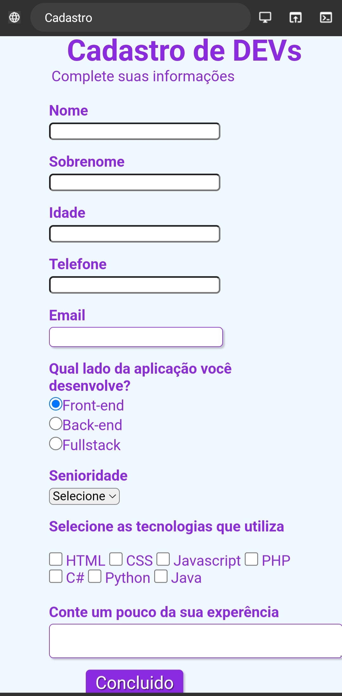

# Formulario-Dev

## Sobre

É  um formulário para cadastro para desenvolvedor.
Neste formulário  o desenvolvedor pode inserir seus dados, como nome, telefone,idade e E-mail. Também pode informar sua senioridade  assim mostrando  seu nível de conhecimento, e as tecnologias que mais utiliza. 

##

### Tecnologias Utilizadas.

 
  
  

##
### Imagem do formulário 

